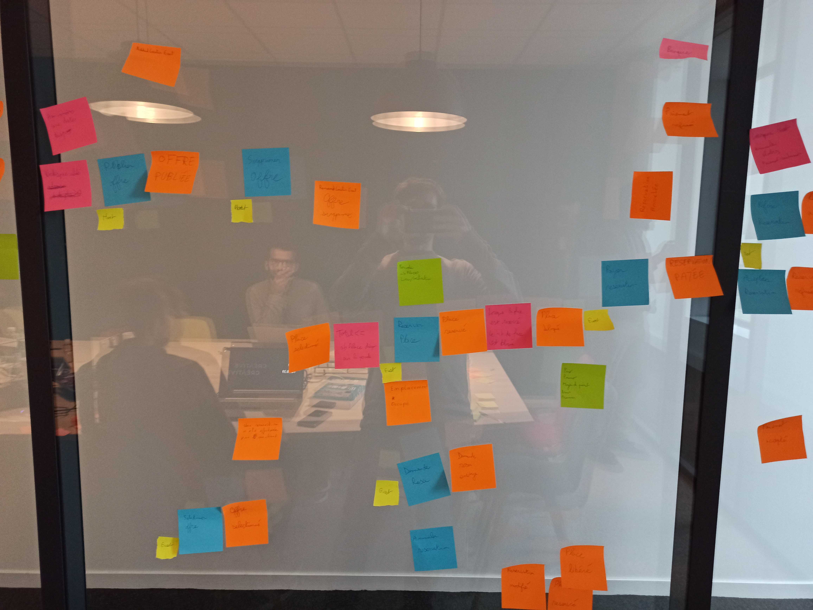

# DDD Training

## Event Storming (Only Event)

.

## Event Storming

      
      
      

## Architecture Oignon

.

## Links

Repo, plein de ressources autour du DDD

https://github.com/ddd-crew

Monolithe modulaire

https://www.kamilgrzybek.com/blog/posts/modular-monolith-integration-styles

https://medium.com/reevoo-engineering/domain-driven-monolith-35d902ee9f80

Modular Monoliths: How To Build One & Lessons Learned

https://www.youtube.com/watch?v=Xo3rsiZYsJQ

And repo: https://github.com/kgrzybek/modular-monolith-with-ddd/tree/master

Hexa, Onion, Clean Together

https://herbertograca.com/2017/11/16/explicit-architecture-01-ddd-hexagonal-onion-clean-cqrs-how-i-put-it-all-together/